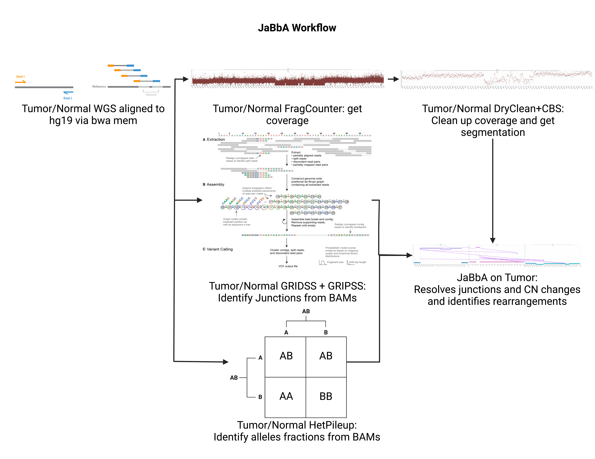

# Running Flow

This is an example pipeline to run flow of two tumor/normal pairs through the hg19
pipeline for JaBbA. There are a few steps to setting up and running these jobs.
After getting through the pipeline we we run a job post JaBbA creation and work
towards visualizing some of the plots.

The pipeline that we will run through is covered here:
```{r Jabpipeline, echo=FALSE}

```

Here we align fastq files into bams for tumor/normal paired samples for WGS. Next,
we run a series of jobs that are required inputs for the JaBbA pipeline. 
However, since the alignment of WGS samples can take upwards of a week, we will start off with a couple aligned hg19 BAM files and begin to work from there.

## Our Pairs Table

This is our pairs table in the purest form, where we have bam files for the associated
tumor and normal sample. We will run the samples through the pipeline:

```{r ptable}
pairs = readRDS("db/pairs.rds")
pairs
```

There is **intentionally** something wrong with one of these samples: try and figure
this out!

## BAM jobs

Once we have our generated bams we are going to run a series of jobs on them to generate
the prerequisites for running JaBbA. There are a series of jobs that will need to done on the bams and they can all be ran in tandem.
So let's try and get one of these going.

The first one is the hetpileup caller, which generates a pile up of our allele fractions
for a sample.

```{bash hetpileup}
cat  ~/tasks/hg19/core/HetPileups.task
```

Here we see a few arguments that will need to be inputed, and there are a couple 
columns in our pairs table that may need to be renamed. The task text table format is something
like this:

|input or output|value name inside the Job class| input label/colname of the file| class expected of input| any default argument|
|---|---|---|---|

For more information on how to set up jobs, the [wiki](http://mskiweb/101/flow.html) on Flow is a good
source to follow.

These jobs/tasks that need to be run on the bams and can all be done in tandem:

|tool|task location|description|
|---|---|---|
|Svaba|`~/tasks/hg19/core/Svaba.task`|SV caller|
|Strelka|`~/tasks/hg19/core/Strelka2`|SNV caller|
|fragcounter (on tumor)|`~/tasks/hg19/core/fragCounter.task`|fragment counting across the genome with GC and mappability corrections|
|fragcounter (on normal)|`~/tasks/hg19/core/fragCounter.normal.task`|same as above but for normal|
|HetPileup|`~/tasks/hg19/core/HetPileups.task`|Get allele fractions for het sites across genome|

**After all of these steps are ran and processed, remember to merge their outputs together and
save this into our pairs table.**

## Working with the outputs.

If all things are working well, we can begin processing some of the bam outputs in
preparation for JaBbA. One of these is dryclean, which further processes the fragcounter
outputs to further remove noise and signal via rPCA using a PON.

### Dryclean

Dryclean our fragcounter outputs for both tumor and normal.

Then we CBS to get our segments.


## Running JaBbA


### Running JaBbA jobs


### Plotting


## Resources and More Reading:

101 on Flow Usage: http://mskiweb/101/flow.html

Links to Tools within the pipeline:
1. [Svaba](https://github.com/walaj/svaba)
2. [Strelka2](https://github.com/Illumina/strelka)
3. [fragcounter](https://github.com/mskilab/fragCounter)
4. Hetpileups is an internal tool, script is found here: ` ~/modules/Pileup/Pileup.R`

